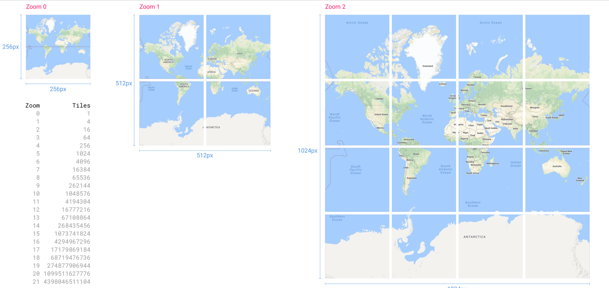
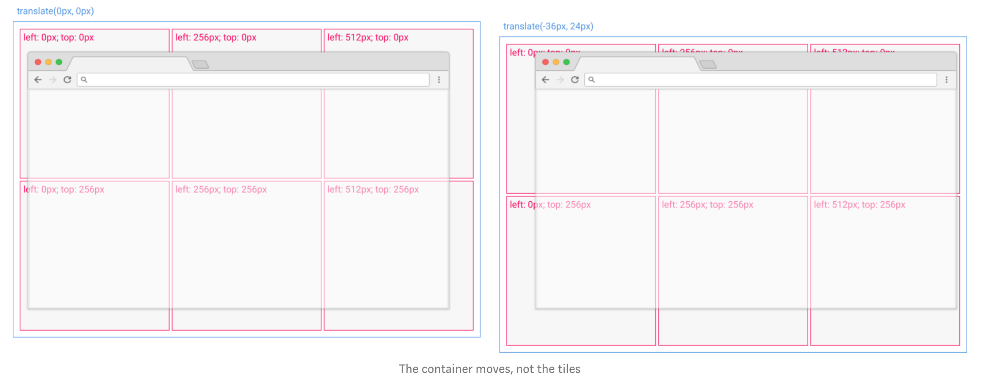
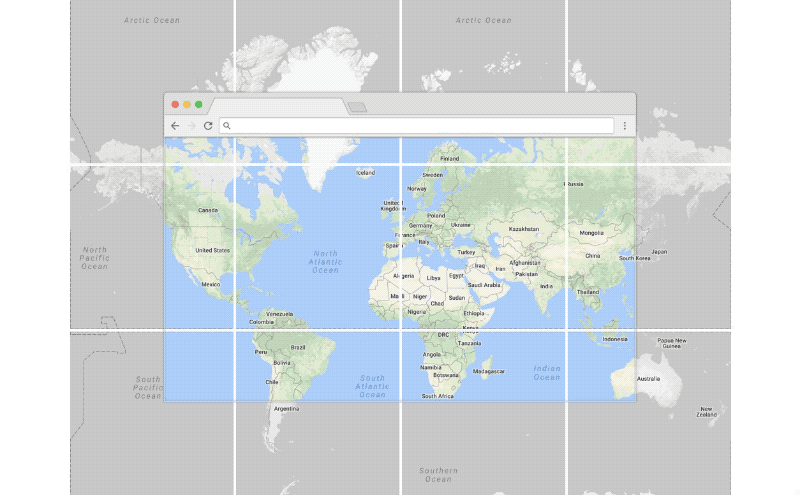
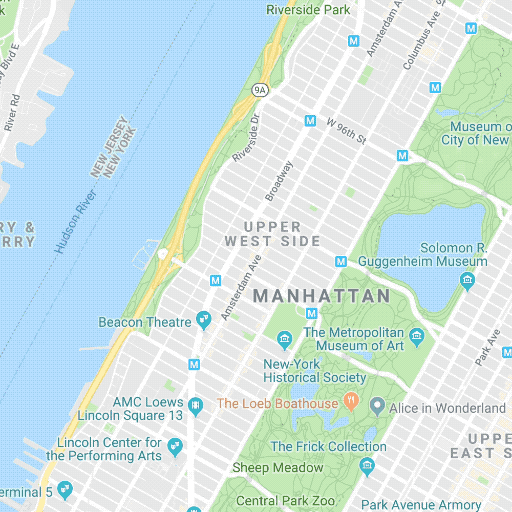
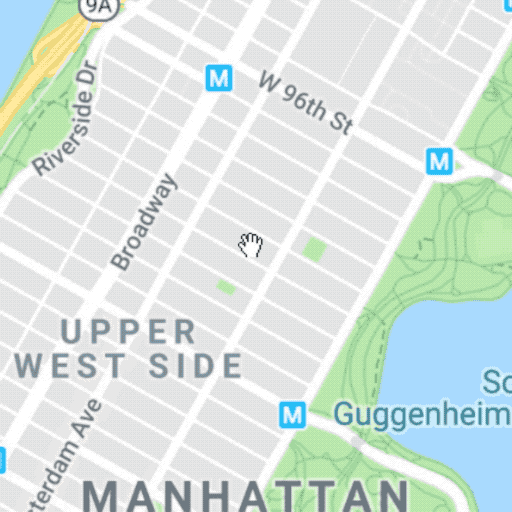
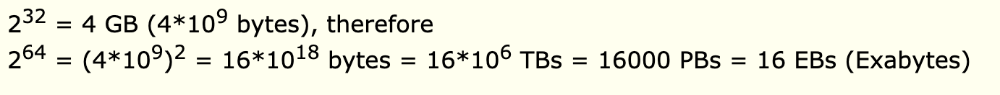

# Requirements
- Google maps shows images of earth and allows zooming in and out of these areas.
# Design constraints
- Earth has an area of around 500 million km2
- Removing 70% water and other non-interesting area, we are left with 10% area that should be actually mapped ~ 50 million km2 = 5 million km2
- Lets say we have one image for each 10mx10m block, and size of each such image is 1 MB
- Assuming 2 road-names and 1 building-name per image: 300 bytes per image
- We will have 100x100 such blocks per km2, so 10,000 MB of images per km2
 - For 5 million km2, we will need 5 * pow(10,11) MB space which is ~ pow(10,12) MB = 1000 PB

We also needs to store zoom levels. 
Assume a factor of 3.3 when zooming up or down, we need to calculate image data at following scale
1. 1000 PB/3.3 = 330 PB
2. 330 PB/3.3  = 100 PB
3. 100 PB/3.3  =  33 PB
4. 33 PB/3.3   =  10 PB

Total upper bound = 1500PB
Note: Yahoo! revealed in 2014 that it stores around 500 PB of data in over 40,000 servers!

# Panning
- Each tile is positioned absolutely within a container, and then when you pan the map instead of moving every tile, only the container needs to move (and the tiles shift with it). This lets the client minimize the number of DOM changes.
- The last positioning trick is minimizing the total number of tiles the browser has to render.

- As the user pans the map the client checks what tiles should be visible and either loads the new ones, or removes the ones that are no longer visible.

- This is done so quickly that the user rarely notices (and instead of clipping to the hard limits of the screen it often fetches an extra few tiles on either side as a buffer).
# Zooming
- Panning around is seamless, but zooming is one of the challenge areas with a tiled map.
- On the technical side the challenge is less how to position the tiles, but more how to transition between levels. Each zoom level is a doubling in scale, and there are no in-between tiles to help.
- Zooming was originally very simple, it just replaced the map with the next set of tiles, but that was a little bit jarring because it would suddenly “snap” between levels.

- One way this is compensated for is instead of zooming in on the center of the map, it keeps whatever location is under the cursor stationary (pinned under the cursor). This enables users to literally “point” at the feature they’re interested in and focus in (they control the reference point).
- A more recent adaptation made it feel more responsive. When zooming, it temporarily keeps both zoom levels worth of tiles (the old and the new) and does a very quick scale animation between them—the new tiles start scaled down by half, and the old tiles are animated up to double size.

- It still “snaps” between layers when the animation finishes, but it all happens so quickly that the eye sort of imagines the in-between state.
- This scale & snap approach is what is still used today by the Google Maps JavaScript API,
- Possibility the biggest limitation with scale & snap is that the user has no control over the animation, once they trigger the zoom it will run until completed, there is no ability to control the speed, or pause at an in-between state.
# Vector maps
- In 2013 Google Maps released a major update to maps.google.com that stopped using PNG tiles for images, and started downloading vector tiles. These vector tiles are still referenced by their tile coordinates, still behave very similarly to the raster tiles, but instead of being an image, they contain all the labels, paths, and polygons—and are drawn on the client.
- There are a variety of reasons why this is important — the vector data compresses better than images (so saves bandwidth), it makes possible dynamic updates and styling (for example if a user clicks on a transit route), and it enables substantially improved zooming.

# HTML5 Canvas

# Storage server
- Assuming a single machine could manage around 15 TB of space
- We would need 1500 PB/ 15 TB = 100,000 database shards.
- We would need some replicas with each shard to handle read traffic and to add fail-tolerance.
- Assuming 1 master 2 replicas per shard system, we would need 300,000 database nodes, each holding 15 TB of space.

Managing 300,000 database nodes could become a nightmare. So instead of just relying on horizontal scaling, we could use some vertical scaling as well. 

Let us see theoretically how much memory is addressable by a 64-bit machine.

- Thus a 64 bit system can theoretically address 16 EBs of space and can theoretically host the entire 1500 PBs of data in a single machine!
- But in practice, systems with such huge memory become exorbitantly expensive.
- So we don't know how to avoid this nightmare of 300,000 servers and to continue our analysis, we would assume that so many servers are actually being used.

# Traffic analysis for Google Maps
- 500 million monthly google map users
- Assuming each user requires 30 minutes of navigation guidance per month, we require 1.5 billion minutes
- How many images are required per minute depends on the speed of travel, which we assume to be an average of 30 km/hour
- 30km/hour will need 30MB of data per hour (because we had 1 MB per km2) which is 0.5 MB / minute
- So for 1.5 billion minutes, we need 1.5 x 109 x 0.5 = 0.75 biliion MB in the whole month = 750 TB traffic/month
- A month has roughly 2.5 million seconds, so we need to support 750 TB/2.5 *106 = 750 MB / 2.5 = 300 MB / second traffic
- Number of requests: As seen in #4 above, 30 requests per hour will be there from each user. This translates to:
- So traffic itself doesn't seem too much of a problem here. Main bottleneck seems to be the data itself.
Our system should be able to quickly locate the image position and return the same within a few milliseconds.
# Maps are from satellites, but where does real-time traffic come from?
## Sensor Assistance
- Governmental transportation departments install solar-powered traffic sensors on major roadways to gather planning statistics, improve accident response times and increase traffic flow.
- Google can partner with these departments to share the costs of sensors while getting a share of the traffic information.
- Google executives then inked a multimillion dollar deal with Inrix, a traffic-related software company that independently gathers commuter data using sensors in 22 countries. https://inrix.com/
## How Traffic Sensors Work
Following are popular traffic sensor
1. radar
    Radar traffic sensors deploy a measureable area of microwave energy that is reflected back to the device when a vehicle passes through it
2. active infrared 
    Using low power infrared energy and infrared beams to form detection areas.
3. laser radar
    Using low power infrared energy and infrared beams to form detection areas.

- In all three types of devices, the time it takes for the energy to bounce back to the sensor is compared to data collected in an unobstructed field to determine the size and speed of the vehicle passing through it. 
- Using a wireless data network the information is immediately transmitted back to a server where it’s formatted and forwarded to subscribers via the Internet.

## Using phone GPS
- For smaller and remote areas, devices running the maps application provide the actual speed the device is traveling to measure speed.
## Stacking the Pros Against the Cons
- Radar sensors can’t help motorists avoid stalled vehicles because they can’t detect objects that aren’t in motion
- Active infrared and laser radar sensors have been known to malfunction in dense fog or blowing snow.
- And the accuracy of crowdsourcing can be diminished when there aren’t enough cell phones providing data for a given area.
# Google acquisition for Map and related services
- 2000: Where2 technologies (powering mapquest)
- 2004: Satellite imaging service 

# Reference
https://prismoskills.appspot.com/lessons/System_Design_and_Big_Data/Chapter_07_-_Designing_Google_Maps.jsp
https://prismoskills.appspot.com/lessons/System_Design_and_Big_Data/Chapter_07_-_Designing_Google_Maps.jsp
https://prismoskills.appspot.com/lessons/System_Design_and_Big_Data/Chapter_07_-_Designing_Google_Maps.jsp

https://www.youtube.com/watch?v=jk3yvVfNvds
https://www.youtube.com/watch?v=HV46i7xUNXg
https://www.youtube.com/watch?v=mdbweU5UY18
https://www.youtube.com/watch?v=suo_aUTUpps
https://medium.com/google-design/google-maps-cb0326d165f5