# Functional Requirements
- Once user provides details on point A and point B, system should provides following
    - What is route user should follow?
    - Given teh route, how much distance has to cover?
    - How much time it will take?
    - With advance version, let propose two or three routes and let user to choose for either shortest distance or shortest time
- It should have very plugable model 
    - Design without any traffic data
    - Adding traffic on existing design should be easy
    - Adding affect of weather or accident should or road block be easy
 - Identify road routes
    - Ask government for data
    - Government might not have all the data, but good to have starting point
    - Lot of users are going through a route, which was not previously identify as a road can be identify as road
    - User users data to even optimize existing route data to find out single lane vs double lane vs four lane road etc
- Goal is to find route between two points efficiently
# Non functional requirements 
- High available
- Good accuracy
- Not too slow
- Scale
    - 1 billions active users per month
    - 5 millions business users (API)
- Model roads
    - 50 millions vertext
    - 100 millions of edges
    - There is no single place to fetch this data
- ETA accuracy can be impacted by
    - weather 
    - road quality
    - accident 
    - road block
there is no math formula to detect it
# Soln approach 
- Use dynamic programming approach 
    - I.e. first solve for small problem 
    - Stores result for small problem
    - Solve slightly bigger problem using already solved problem
# Google S2 library 
- Divide earth into square of blocks/segments

- Blocks/Segments of 1km * 1km
- Divide city into multiple blocks
- Each block has an identifier
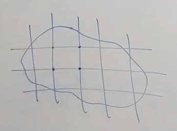
- Whether a point lies into a segments should be easy to calculate
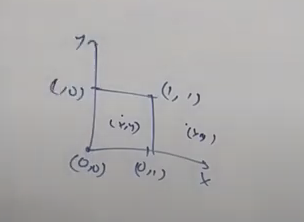
- Map each user to segments based on location
- It is also easy to find out aerial distance between two segments
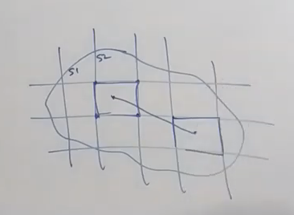
# Model road network
- model as graph
- edge connected to two nodes are represented as road
- it will be directed edge
- Each road will have multiple weight
    - distance
    - duration
- Infinite duration represent for no road
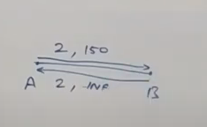
# Find out shortest path between two points/junctions in single segments

- `A`, `B`, `C`, `D` etc are junctions
- How to go between `A` and `C`
    - A, B, C
    - A, B, E, C
    - A, I, H, G, F, E, C
    - A, I, H, G, F, E, D, C
- How to find out best route?
    - Dijkastra: Get shortest path between two points. Doesn't work for negative weight.
    - Bellman ford: Works for negative weight as well. Also works for k most hops
    - Floyd's algo: Calculate all possible route for all points
- Once calculated, cache it as calculated edge
    - Use Floyd's algo
    - Stored in separate database as key/value lookup

# Find out shortest path between two points on road in single segment
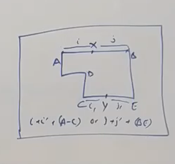
- Get the distance between two junctions and take the minimum
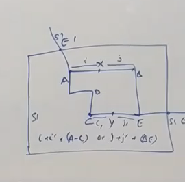
- Consider exits of road
- Calculate junction distance not only from other junctions but also from exits
    - Get shortest distance between C to S1E1
    - Get shorted distance between C to S1E2
- Stores exit routes in cache as well
# Solve route across segments
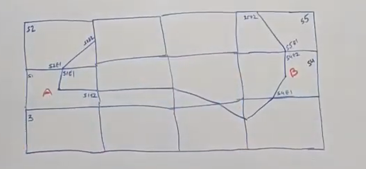
- Given the lat/long, get the aerial distance between two points
    - Let's say 10km
    - We know that segment is 1km * 1km
    - By adding buffer, we can say that we will not cover more than 20 segments in each direction, either going north/south or east/west
- This gives how many segments we need to look into 
- I.e. no need to run dijkastra algo for entire globe
- One approach is to simple run dijkastra algo across city and get the shortest distance
    - Since many users are running similar query so running dijkastra will be heavily inefficient
- Run optimize logic
    - There are two exits from A block to reach to block B
    - Exit A has two co-ordinate, one for S1 and second for S2
    - Similarly exit B has two incoming co-ordinates
    - If you connect all exit to exit for 10 blocks on north side, 10 blocks on south side, 10 blocks on east and 10 blocks on west, you will able to come up with many paths
    - Within each segment, path is already calculated so we don't care what is happening withing that segment
    - what we care is simply exit point distances and use it
    - Now we can run dijkastra to get the shortest path between A and B
    
    - This works fine if you have to travel for 10km
    - How it will works if you want to travel intra city
        - There will be huge number of segments
        - It will be super inefficient to run dijkastra algo
# Solve route across cities 
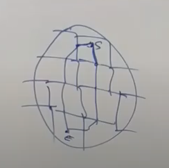
- Divide a country into mega segments
- Connects the exit points of individual mega segments
- We don't care how shortest path was calculated within the mega segment (as it was already pre calculated and cached)
- All we care about is start point and how to get into exit points
- Technically you might have `n` level of nesting, but ideally `3` level of nesting is more than enough
- Need to comeup with ideal size of mega segments

# Road/Edge weight as distance/eta
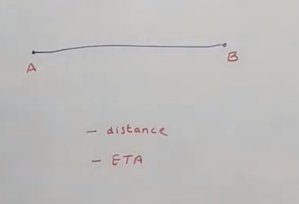
- Distance between two points
- under normal condition/weather how much time it takes
- You can calculate avg speed
# How to add traffic/weather impact
- Don't add traffic weight as an edge. 
- If you do then you are going to change the logic under which Dijkastra runs it's algo. 
- It would be an attribute of avg speed
    - Could be a function of traffic
    - Could be a function of weather
    - Could be a function of road blocks
- Traffic data is always normally distributed, Google doesn't care a lot of traffic/weather as real time information, it simply use the window of normal distributions as an realtime data
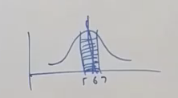
- Traffic and other data comes into picture if 
    - Not able to get the realtime user data
    - Legally not allowed to get data from user

How to quantify traffic?
- It's not easy to calculate number of vehicles on the road
- We will create multiple tier 
    - Traffic
        - Low
        - Medium
        - High
    - Weather
        - Good
        - Bad
With good weather and medium traffic, calculate the avg speed
What to do if traffic is increased?
- If real road edge weights are changing
- then find out related cached roads are impacted
- Update the cached edges
- You will do it for one segment
- Then recursively bubbleup to across lot of cache 
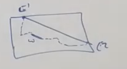

- If there is mega segments 
- As and when traffic signal is coming, you perform update
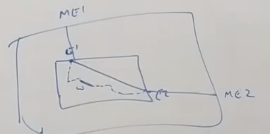
How to use historical data?
- Get the day of the week and the hour of the day
- Cache the historical eta 
- Reuse it either without traffic signal or without traffic/weather etc
# ETA limit
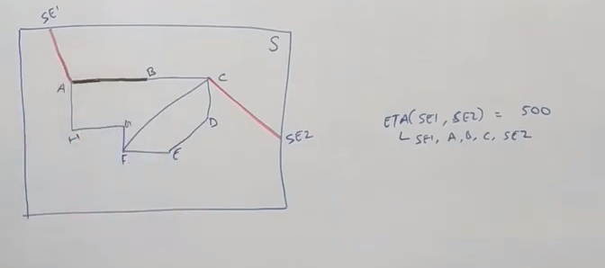
- There is limit it can bubble up
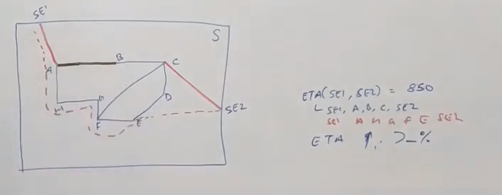
- Let's say ETA increased from `500` to `550`, this increase is ok
- Let's say ETA increased from `500` to `850`
    - This is a big jump
    - One of the possibility is that fastest route is no more using `AB`, may be some other route
    - If ETA increased by `X%`
        - we will recalculate for that segment
        - Let's say we found a new shortest path
        - We need to bubble up this information
        - First we need to update that whosoever is travelling from `SE1` to `SE2` needs to be update route
        - Update mega points as well if it contains this impacted segment
# Architecture to capture user's location
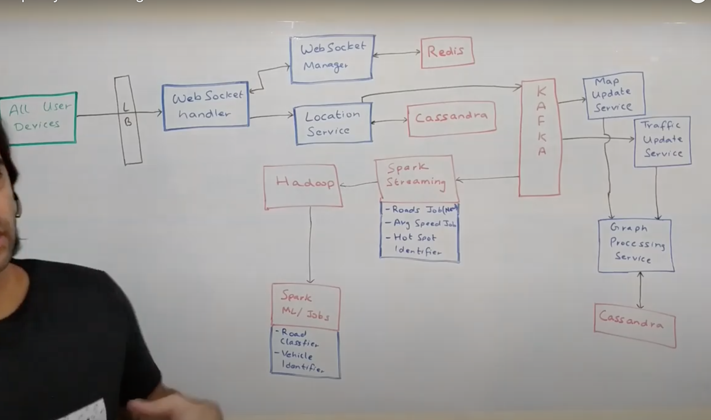
- If App is installed on user's phone and location service is on, you will get ping from user's device on regular interval to send location.
- IF user is stationary then device will have logic to not to send location data to server frequently, may be every 10 or 30 seconds etc
- Device keeps persistent connection to WebSocket server for two ways communications
    - Might be 1000 of websocket server to handle billions of user devices
- Websocket manager keeps track of which device is connected to which websocket handler
    - It stores this information in in-memory storage (Redis)
    - If it lost the data then it will be repopulated based on heartbeat
- As an when user is sending it's location, it will go to `Location Service`
    - This is repositories of all the location related services
    - It exposes API to ingest user's data
        `updateLocation(userId, timestamp, lat, long, alt)`
    - Stores all location data in storage server (cassandra)
    - This track which user was on which location at given point of time
    - Remember, this is not for user using App for navigation but also for all the users in the world
    - As when it gets location pint, it sends to the Kafka topic
- Message from Kafka topic is read by Spark streaming for lot of calculations
    - If lot of users are travelling at a places which we didn't identify
        - Check movement pattern to see if it is road
        - Streaming job to check for last 10 minutes of data to analyze the pattern
        - It is used to add new road to our system
        - It will impact the segments where new road will be added
        - I.e. we will have to recalculate all the information related to that segments/mega segments.
    - Calculate average speed
        - It looks for related segment and check what was the average speed segments had for the route 
        - Use new data as proxy to realtime information and update the weight of the route 
        - This may lead to recalculate segments/mega information
    - How does this bubble up information happened?
        - Streaming job writes back into Kafka in separate topic (for new road, change in avg speed etc)
    - Hotspot identifier
        - On sudden lot of people start gathering in that area
        - It gives a signal that some activity happening in that area
        - it could be some social event (sports etc) is happening 
        - It dumps data into Hadoop system
- New roads speed data from kafka topic read by `Map Update Service`
    - It invokes `Graph Processing Service` which then update the routes/segments
- New avg speed data from Kafka topic read by `Traffic Update Service`
    - It invokes `Graph Processing Service` which then update the routes/segments
- Hadoop System
    - Road classifier
        - Run ML job to identify if it is single lane/ double lane/ two ways etc
        - This will put event into Kafka topic which will be consumed by `Map Update Service`
    - Vehicle identifier 
        - If device is pinging at very high speed i.e. person is travelling
        - Let's say if person is stopping every few stops (some distance of km), it means there is either traffic light or possible traffic jam
        - We know the junctions, and based on that we can identify if it is traffic jam/stoppage (based on ohter user's data)
        - If not then person might be using public transport 
        - If ride is bumpy and person is not driving straight instead left/right then person might be using motor bike
        - Identify different categories of two wheeler
        - Identify if user is running
# Architecture for navigation
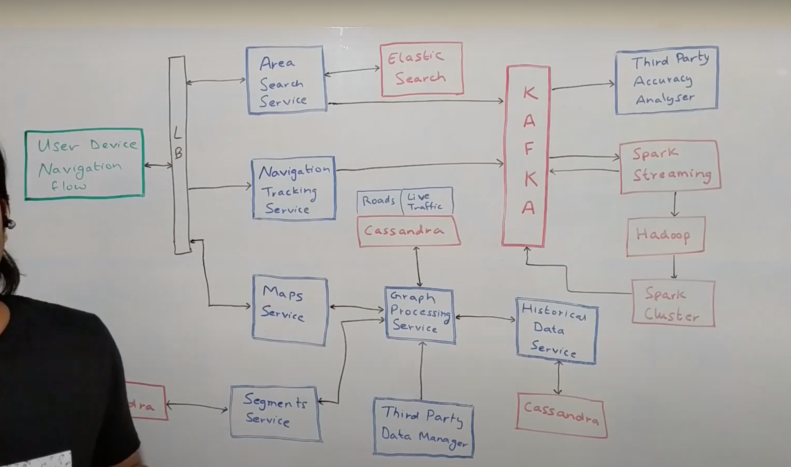
- `Area search Service`
    - User search for particular location which gets converted into particular lat/long
    - It does two things
        - Based on data in elasticsearch, does fuzzy searching and based on that it search given keyword and return lat/long 
        - It also take the address to pint out lat/long
    - This will gives user device both start and end point
    - It will also sends event into Kafka to calculate area most search etc
- `Navigation Tracking Service`
    - When user started travelling then all of its location is tracked by this service
    - It does two things
        - If user is deviating the suggested route, it will inform app back then app will show some popup to communicate to user
        - It also sends data to Kafka topic for further analysis (for example, recommended route for person A to find out how good was recommendation)
- `Map Service`
    - It provides multiple interfaces
    - user device use the end point to get the best route for given two points
    - Business user also use similar end point 
    - This itself is not intelligent service, it forward request to `Graph Processing Service`
- `Graph Processing Service`
    - It calls segment service to get all related segments
        - if both points are within the segment then it is short duration ride
            - It checks if data is already cached, if yes then simply return
            - If not then it will run Dijkastra algo to get the route, update cache and return
        - If multiple segments
            - Pick the subgraph of whole world as per segments
            - Run Dijkastra algo
                - First fetch all the roads withing segments
                - Get all entry exit points for road
                - It also have live traffic information which could be used to update the ETA
                - Also get input from third party data manager
                    - it doesn't directly pull data from Third party
                    - Instead, Third party sends data into Graph Processing service which writes into Cassandra storage
                - If it doesn't have live traffic information then it will look for historical data if any
                - Based on all information, it wll first look into cache, if has data then return
                - If cache is empty then re-run Dijkasta to get the best route

- `Segment Service`
    - It stores all the segments and their corner co-ordinates 
    - This expose API to get the segments for given start and end points
- `Historical Data Service`
    - on day X, at time Y, from point A to B, how much was avg speed of people
    - How much ETA it can expect from A to B
- `Third party accuracy analyzer`
    - Analyze all third party to check which one is giving right data and which one is giving wrong data based on real time data
- `Spark Streaming`
    - Identify user is on which road
    - It help to voice over to identify turn and say left/right turn etc
    - It also says where I am and how much time is left to reach the destination
    - What is road name I will get next

# Analytics on data
- ETA predication analysis 
- Recommended route vs chosen route
- Hotspot where people gather
- Home location/work location
- User profile (traveler etc)
# Handle disputed area
- For example India, Pakistan and China dispute
- Based on country you are coming from, it shows different map
- People coming from India, it will show whole part of claimed area and hard line between china and pakistan as they don't have any border conflict
- People coming from Pakistan, it will show whole part of claimed are and dotted line between India and China disputed area
- People coming from China, it will show whole part of china and dotted line between India and Pakistan

# Reference
https://www.youtube.com/watch?v=jk3yvVfNvds

https://medium.com/google-design/google-maps-cb0326d165f5

